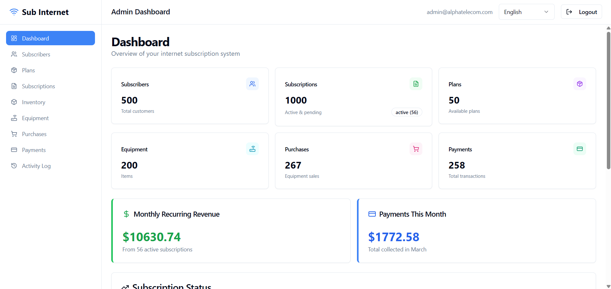
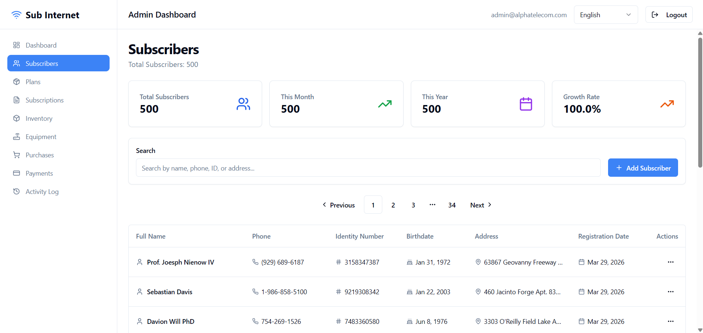
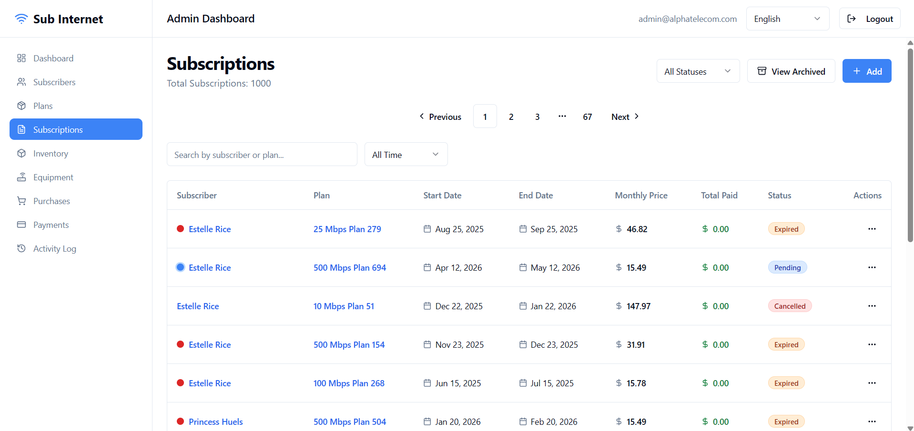
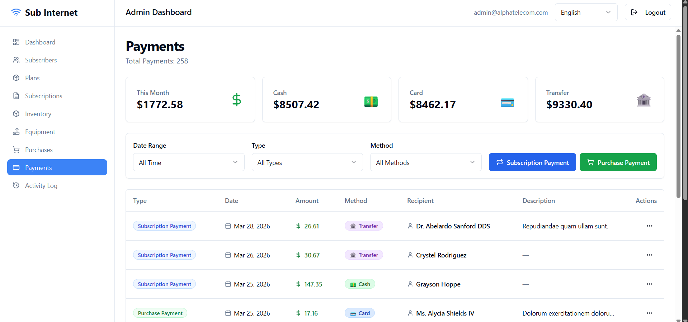
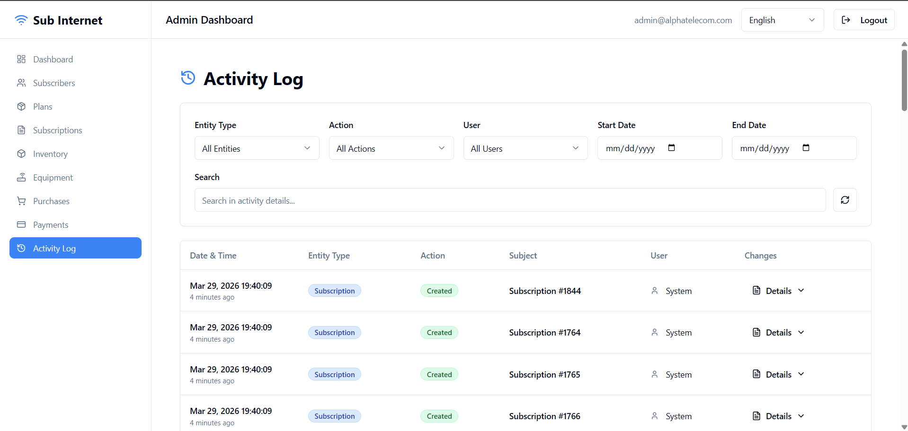
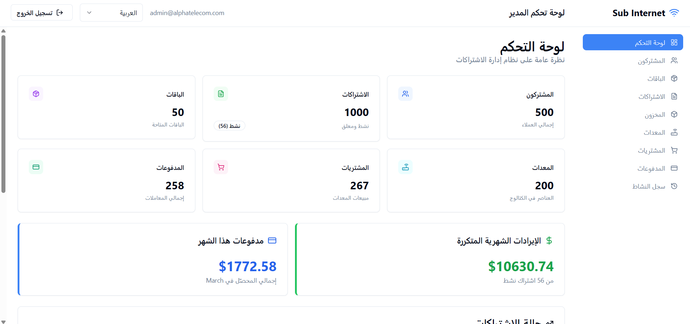

# Sub Internet — ISP Subscriber Management Platform

Full-stack ISP management system built for a real telecommunications business, centralizing subscriber lifecycle, billing, inventory, and operational workflows into a unified platform.

---

## Overview

- 9 integrated business domains (subscriptions, billing, inventory, payments, etc.)
- Backend-focused architecture using Laravel 11 (REST API)
- React 18 + TypeScript single-page application (SPA)
- Secure authentication with Laravel Sanctum (multi-subdomain setup)
- Role-based access control (RBAC) and full audit logging
- Bilingual interface (Arabic / English) with dynamic RTL/LTR support
- Containerized environment using Docker

> **Status:** Deployed in a real business environment (early-stage usage), with ongoing development  
> **Live website:** https://darkslateblue-marten-372275.hostingersite.com  
> **Demo Login:** on request
>
> **Note:** Source code is private due to business confidentiality. This repository showcases system architecture, features, and UI. Code is available upon request for hiring purposes.

---

## Tech Stack

| Layer | Technology |
|------|-----------|
| Backend | Laravel 11 (PHP) |
| Frontend | React 18 + TypeScript |
| Styling | Tailwind CSS + shadcn/ui |
| Authentication | Laravel Sanctum (SPA) |
| Database | MySQL |
| Infrastructure | Docker, Apache |
| Permissions | spatie/laravel-permission |
| Audit Logging | spatie/laravel-activitylog |
| Internationalization | react-i18next (RTL/LTR support) |

---

## Core Features

### Business Domains
- Subscriber management (profiles, notes, validation)
- Subscription lifecycle management (active, expired, archived)
- Internet plan configuration and assignment
- Equipment catalog and inventory tracking
- Purchase and payment management
- Activity logging and audit trail system
- User management with role-based access control

### System Capabilities
- Secure SPA authentication across subdomains (Sanctum + CSRF + CORS)
- Fine-grained RBAC with backend and frontend enforcement
- Field-level audit logging (before/after change tracking)
- Advanced filtering, pagination, and search across large datasets
- Fully bilingual UI with dynamic RTL/LTR layout switching

---

## Architecture

Client (React SPA)
│
▼
Apache (subdomain routing)
│
▼
Laravel API (Sanctum Auth, RBAC, Business Logic)
│
▼
MySQL Database

### Infrastructure Notes
- Multi-service containerized environment using Docker
- Subdomain-based architecture:
  - `app.*` → frontend
  - `api.*` → backend
- HTTPS-enabled local development using mkcert

---

## Screenshots

### Dashboard

### Subscribers

### Subscriptions

### Payments

### Activity Log

### Arabic UI (RTL)

---

## Key Engineering Decisions

### SPA Authentication (Sanctum vs JWT)
Laravel Sanctum was chosen for cookie-based SPA authentication to simplify session handling and avoid token refresh complexity. This required careful handling of CORS, CSRF protection, and cross-subdomain cookies.

### Containerized Architecture (Docker)
Docker was adopted early to ensure consistent environments across development and deployment, eliminating environment-related inconsistencies and simplifying future scalability.

### RBAC & Audit Logging
Implemented using spatie packages to provide scalable role/permission management and complete traceability of system actions through audit logs.

### Bilingual System Design
The application supports both Arabic and English, with full RTL/LTR layout switching. This required careful handling of UI components, layouts, and input behavior.

---

## Contact

**Ibrahim Kshkieh**  
📧 ibrahimkshkieh10@gmail.com  
🔗 https://linkedin.com/in/ibrahimkshkieh10  
💻 https://github.com/ibrahimkshkieh
